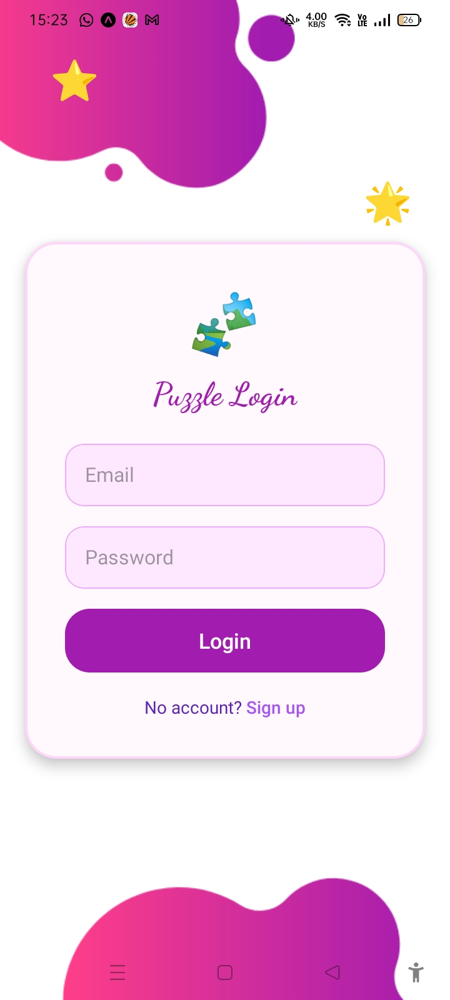

# 🚀 Educational Puzzle App (Eduzzle)

  
*A fun and engaging **Educational Puzzle App** built with React Native and Node.js backend to help students learn through solving puzzles!*


## 📸 Screenshots

| Splash View | Login Page | Signup Section |
|----------|---------------|-------------|
|  |  |  |


| Puzzles Page | Profile Page | Play Section |
|----------|---------------|-------------|
|  |  |  |


| Puzzles Easy Level Page | Puzzles Medium Level Page | Puzzles High Level Page|
|----------|---------------|-------------|
|  |  |  |


## ✨ Purpose of the App

> Eduzzle is designed to make learning interactive and fun by offering a variety of educational puzzles.  
> It helps students and learners of all ages improve their problem-solving, critical thinking, and subject knowledge in an engaging way.  
> Inspired by the need to combine education with gamification, this app motivates learners to practice regularly and track their progress over time.

---

## 🛠 Tech Stack

- Frontend: React.js / React Native / HTML / CSS
- Backend: Node.js / Express
- Database: MongoDB
- Others:  CSS  / Canva / Figma / etc.

---

## 🤝 Collaborators

| Name           | GitHub                                   | Email                  |
|----------------|------------------------------------------|------------------------|
| Abhishek Yadav | [@abhiishek2408](https://github.com/abhiishek2408) | abhishekydv2408@gmail.com   |
| Vishesh Ydav   | [@vishesh2408](https://github.com/vishesh2408)       | visheshyadav62@gmail.com   |


---

## 📚 What We Learned

- How to break down complex problems into smaller, manageable components.
- Collaborating effectively as a team using Git and GitHub.
- Designing and integrating a React Native frontend with a Node.js + Express backend.
- Handling user authentication, form validations, API requests, and proper error handling.
- Deploying the backend to Vercel and understanding version control workflows.
- Managing environment variables and securing sensitive information (like database credentials).


---

## 🚧 Installation & Running Locally

```bash
# clone the repository
git clone https://github.com/abhiishek2408/EduzzleApp-React-Native.git

# navigate to the project directory
cd EduzzleApp-React-Native

# install dependencies
npm install

# run the app
npm start
